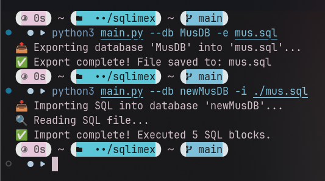

<div align="center">

# SQLImEx
**Simple Import/Export for Microsoft SQL DB**

[](https://t.me/musdev)
[](https://github.com/musdev13)



## About
**SQLImEx** *(SQLImportExport)* - it's a simple and easy to use utility for import/export actions with your Microsoft SQL DB.

</div>


* It requests database information from the server and generates an .sql database dump.
* For importing, it creates a new database and runs the selected .sql script/dump inside the new database.

<h2 align="center">Installation</h2>
<h3 align="center">Manual</h3>

#### Dependencies:
* Python

#### 1. Clone repo and cd repo
```sh
git clone --depth=1 https://github.com/musdev13/sqlimex.git
cd sqlimex
```

##### 1.1 venv (optional)
```sh
python3 -m venv venv
source venv/bin/activate.*
```

#### 2. Install dependencies
```sh
pip install -r requirements.txt
```

<h2 align="center">How to ues</h2>

> I'll alias `main.py` as `sqlimex`

<h3 align="center">Init and configure sqlimex</h3>

#### 1. First run to init
```sh
sqlimex
```
It should output something like this:
```
⚠️ Created config: ~/.config/sqlimex/config.json
💛 Please fill in server, username, password.
```

#### 2. Configure `config.json`
```sh
nvim ~/.config/sqlimex/config.json
```

#### 3. Check help command
```sh
sqlimex -h
```

<h3 align="center">Usage</h3>

#### 1. List DataBases
```sh
sqlimex --db ""
```
```
📚 Available databases:

- master
- tempdb
- model
- msdb
- MusDB
- newMusDB

⚠️ Please set a valid DB name with --db 😊
```

##### 1.1 List tables in DB
```sh
sqlimex --db MusDB
```
```
Tables:
- Users
- Books
```

#### 2. Import DB
```sh
sqlimex --db newDB -i someDB.sql
```
```
📥 Importing SQL into database 'newDB'...
🔍 Reading SQL file...
✅ Import complete! Executed 42 SQL blocks.
```

#### 3. Export DB
```sh
sqlimex --db newDB -e newDB.sql
```
```
📤 Exporting database 'newDB' into 'newDB.sql'...
✅ Export complete! File saved to: newDB.sql
```